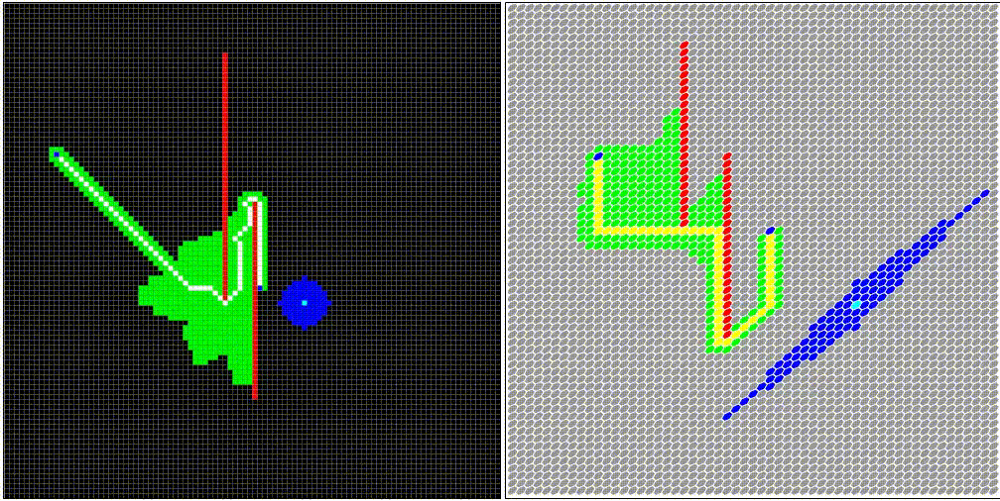

# astar

npm install astar-template

const PathFinder = require('astar-template')

let finder = new PathFinder();

finder.debug = function (node) {}

# must implement your：

## function finder.debug(node);
## function finder.isSameNode(m,n);
## function finder.calcH(curNode,toNode);
## function finder.listNeighborNode(node);
## function finder.mapcheck(node);

